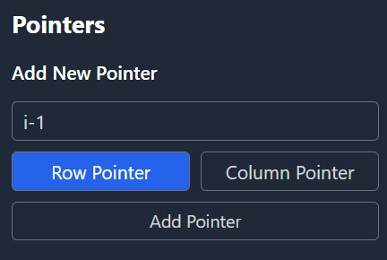

# Array Index Visual Debugger

This extension lets you visually debug arrays alongside the variables that point to their indices.

Currently, it only works well with Python.

## Usage

1. Start a debug session.

2. Open the command palette and run `Array Index Visual Debugger: Open Panel`.

3. Enter the name of the array and select whether it's 1D or 2D.

    

4. Enter the index variables you want to visualize. In 2D mode, you’ll need to specify whether each variable represents a row or a column index. (Note: The values you enter here are evaluated as expressions in the debugged program. If you enter an expression with side effects, those side effects will occur in the debuggee.)

    

5. Step through your code (using the VS Code debug controls) — the panel will automatically highlight the positions in the array corresponding to the specified index variables.

    

6. *(Optional)* In 2D mode, you can highlight specific cells by specifying combinations of row and column index variables.

    
